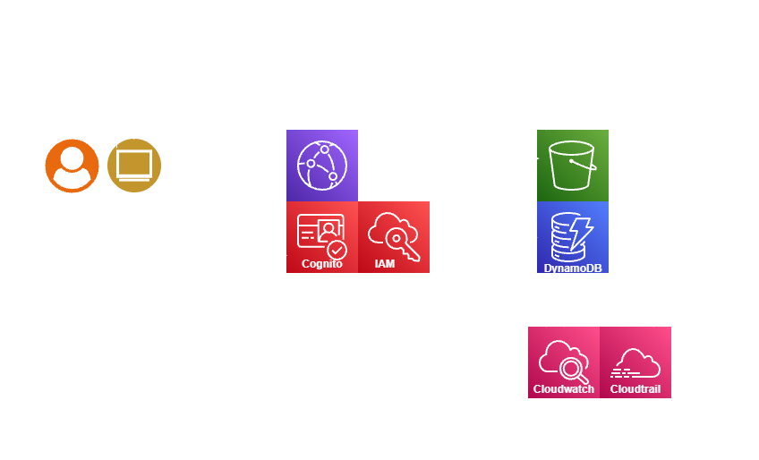

# CloudSafe Vault

Secure File Sharing & Storage on AWS

## Project Overview
CloudSafe Vault is a cloud-based, serverless web application designed to securely
store and share files using modern AWS services. The system focuses on minimizing
unauthorized access by enforcing identity-based access control and using
time-limited sharing mechanisms.

The project demonstrates secure cloud architecture design principles with an
emphasis on scalability, least-privilege access, and simplicity.

---

## Key Design Highlights
- Fully serverless architecture (no EC2, no traditional backend servers)
- Secure, private file storage using Amazon S3
- User authentication and identity management with AWS Cognito
- Fine-grained access control using IAM least-privilege policies
- Temporary file sharing using time-limited access (pre-signed URLs)
- Monitoring and auditing through AWS CloudWatch and CloudTrail (design-level)

---

## Architecture Diagram

---

## Technologies Used
- **AWS S3** – Secure file storage
- **AWS CloudFront** – Content delivery and HTTPS
- **AWS Cognito** – User authentication and identity management
- **AWS DynamoDB** – File metadata storage
- **AWS IAM** – Access control and permission management
- **AWS CloudWatch & CloudTrail** – Monitoring and logging
- **HTML, CSS, JavaScript** – Frontend interface

---

## Project Status
- Serverless cloud architecture fully designed using AWS services
- Frontend user interface implemented and hosted for demonstration
- Security principles (authentication, authorization, least privilege) applied in system design

This repository serves as a **portfolio project** showcasing cloud architecture
and security-focused design.

---

## Live Demo
GitHub Pages:  
https://ahmad-abdulmajid.github.io/cloudsafe-vault/

Source Code:  
https://github.com/ahmad-abdulmajid/cloudsafe-vault

---

## Author
Ahmad Abdulmajid  
Cybersecurity | Cloud Computing  
Syrian Virtual University
